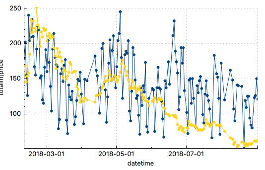

# subreddit_scanner_script

## Summary
The main function of the script is to scan for the cryptocurrency coin mentions in the "CryptoCurrency" subreddit and save data into the file. Data can then be analyzed or reused for any kind of statistical purpose. Program has been built to run on Raspberry Pi Zero autonomously. It uploads data and log file on specified Dropbox account so that user can remotely analyze data and check for the errors and malfunctions. 

## How it works
Script has been made in python and tested on version 3.5. It uses reddit.com and dropbox.com APIs, both of which must be configured before use. More about configuration in next chapter. Script closes automatically after saving new data and uploading it to Dropbox, so in order for it work continually crontab must be configured. 
Crontab example from Raspberry Pi:
```
*/10 * * * * cd /home/pi/binance_bot/ && /usr/bin/python3 /home/pi/program.py$
```
Have in mind that interval parameter and crontab must be configured accordingly in order for script to function properly. For example if you want program to run once a day use following setting:
- ```interval = 86400```
- ```*/10 * * * * cd```
Script creates database file where it stores all the data, and log file where it stores statistics and errors.

## Parameters and authentication
Confuguration is on lines 3-16 of "program.py" file. Here is the quote:
```
### PARAMETERS ### --------------------------------------------------
interval = 86400                            ## For how old posts script is scanning for? [s]
db_name = "database_d.db"                   ## Database name for saving
log_name = "log_d.txt"                      ## logfile name for saving
dropbox_token = ''                          ## insert dropbox token of your account

### Authorize, Select subreddit w. sort settings ### ----------------
def authenticaton():
    try:
        reddit = praw.Reddit(client_id = '',
                             client_secret = '',
                             username = '',
                             password = '',
                             user_agent = '')
```

## Result
Here is the example of using data gathered from the script.


**y-axis**: 
Yellow line: LTC price [USD]
Blue line: LTC total mentions in 'CryptoCurrency' subreddit
**x-axis**: 
datetime